# 前言
C语言是我们入门编程的第一个基础语言，学完C语言再去学其他语言会变得很轻松，目前在某院校教授C语言课程，看到很多同学在学习的时候和我当时一样迷茫，所以这边整理一下授课的笔记，希望大家在今后的编程道路上可以打下一个良好的基础。
其中P0（掌握），P1（熟悉），P2（了解）
## 第一章 C程序设计概述
**1.1 程序设计语言和程序设计**
*1.1.1程序与程序设计*（P1）
要学习一门语言，首先就要了解这门语言发展过程：
1. **低级语言**
  *机器语言*：计算机诞生时使用的语言，使用**二进制代码**进行编写，**可读性非常差**，例如：*10000000代表加*的操作，不仅开发人员难以编写而且维护人员也很难看懂，并且不同的计算机有不同的机器语言，所以**移植性是非常差**的。
  *汇编语言*：汇编语言是对机器语言的改进，比如刚刚的10000000加法就可以使用ADD来代替，这种代替的符号就是**助记符**，但是由于计算机只能识别二进制代码，所以此时需要请一个翻译（**汇编程序**）来对助记符进行一个翻译，但是它任然没有可移植性，只是将原本的二进制代码使用符号进行了替换。
2. **高级语言**
   尽管汇编对机器语言进行了优化，但由于它仍然不够简便，并且没有可移植性，所以就有了**高级语言**，高级语言通过**编译程序**，**编译器会针对目标平台的指令集和操作系统特性进行优化，确保生成的代码能够在该平台上正确运行**，常见的高级语言有C语言、JAVA、Python、C++....

*1.1.2 程序与程序设计*（P1）
在写程序的时候，也需要遵循一定的规则和步骤，才能保证程序完整可靠的运行起来：
1. **明确需求**：
   在前期需要明确最后程序的目的，哪些数据需要用户来进行输入，最后输出哪些数据，搞清楚需求了编写程序才会如鱼得水。
2. **确定数据结构和算法**：
   明确所使用的这些数据的**数据结构**，例如我保存一个人的年龄需要使用整数，保存一个人的平均成绩需要使用小数等，然后通过明确的**算法**对此进行编写。
3. **编写程序**：
   这是五个步骤里最重要的一个过程，我们编写的这一步步的代码就是程序的指令，也就是解决问题的步骤，最后这些指令所组成的就是程序。
4. **调试和测试程序**：
   在写完一个程序之后，需要对其进行调试，验证不同的输入是否可以产生预期的输出结果，如果不能，回到第三步修改BUG。
5. **维护**：
   在做完了基本的测试之后，程序成功上线了，后期我们仍然需要对其进行维护，以免产生未检测到的错误。

**1.2 算法的概念和表示方法**
*1.2.1 算法的概念*（P0）
**算法就是解决问题的方法和步骤**
1. 算法的特性
  （1） **可行性**：算法的每一步都是计算机可以执行的，不要写程序计算机都看不懂
  （2） **确定性**：算法中的每一步必须有明确的定义，不能写的模棱两可
  （3） **有穷性**：算法必须在有限的步骤结束，它不是无穷无尽的
  （4）**可输入/输出信息**：*一个算法可以没有输入，但是必须有输出*，如果没有输出，这个程序将毫无作用
  
*1.2.2 算法的表示方法*（P1）
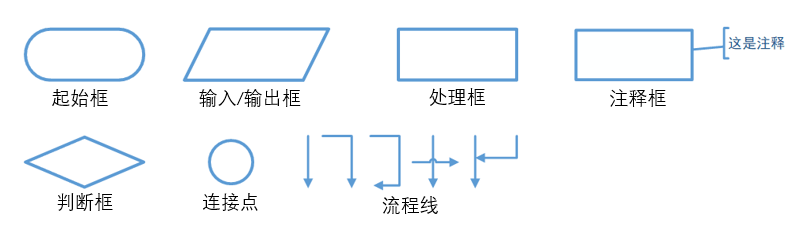
1. 起始框：表示算法的结束和开始
2. 输入/输出框：用于填写算法需要的输入数据和输出的结果
3. 处理框：表示算法正常需要处理的步骤，比如将输入的数据进行加一的处理
4. 判断框：对判断框中的条件进行判断，例如条件框中的条件是“听没听懂”，条件会有成立（懂啦）和不成立（没懂），成立执行什么处理，没成立执行什么处理
5. 流程线：控制算法的执行方向，上面所说的这些框都是流程线来进行连接的
6. 连接点：用于将画面中不同的地方的流程线连接起来，一般用于流程图画不下需要分开画的时候
7. 注释框: 类似于我们写代码时的注释，用于对上述的1~6做一些解释的作用

*1.2.3 算法的三种基本结构*（P0）
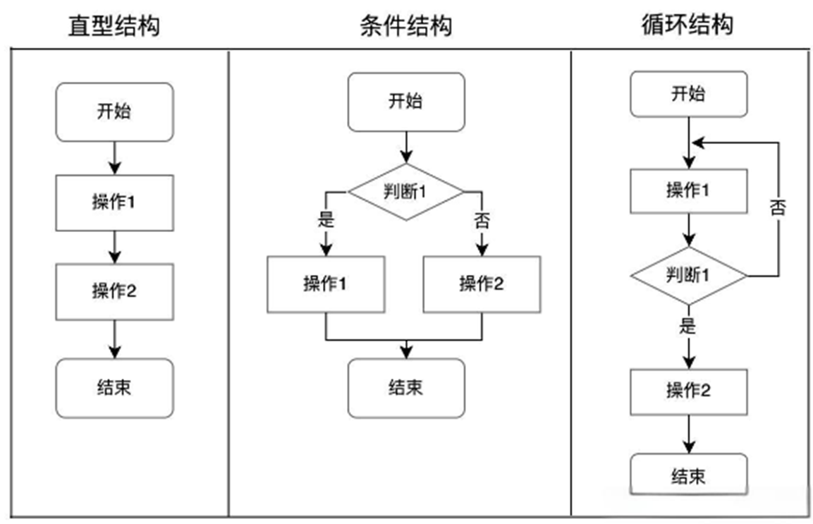
1. **顺序结构**：程序一步步按顺序向下执行
2. **选择结构**：程序碰到判断条件，成立执行什么处理，不成立执行什么处理
3. **循环结构**：如果某个条件成立，就会一直循环执行某个处理，如果不成立就可以跳出循环
例题：判断2000到2500之间有多少个闰年？
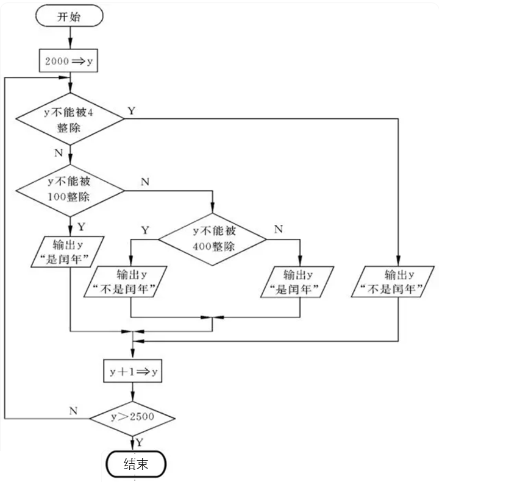
这个流程图呢不仅包含了顺序还有选择和循环，如果参与运算的数不大于2500就一直执行+1的循环处理，Y表示Yes成立，N表示No不成立
这边推荐一个画流程图的网站 [点击这里进入](https://www.draw.io/)

**1.3 C语言概述**
*1.3.1 C语言的产生和发展*（P2）
1978年贝尔实验室正式发表了C语言，以下是C语言发展的流程图：
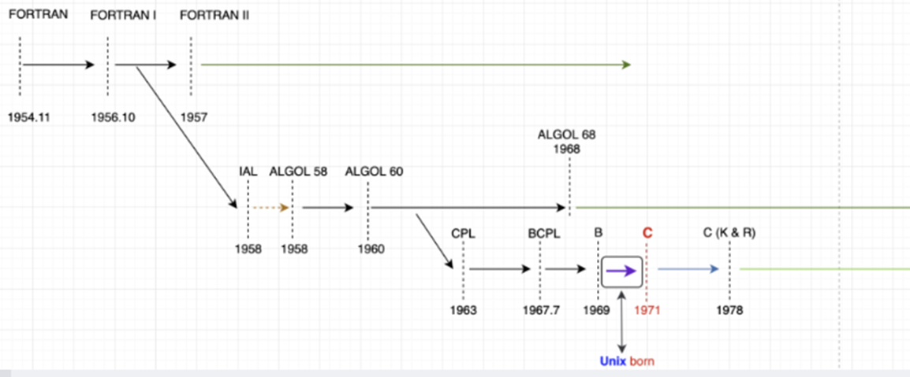

**热身程序：**（P0）
好啦，我们来看一个热身程序，作为我们学习C语言的第一个程序
```C
   #include <stdio.h>
   int main(){
      printf("这是第一个C语言程序！");//打印引号内的内容在控制台
      return 0;
   }
   /*
      多行注释1
      多行注释2
   */
```
1. **第一行**
   这是一个预加载命令，让你的程序能够使用标准输入输出库中的功能，比如说下面的printf()功能
2. **第二行**
   定义了一个函数main(),main就是这个函数的名字，C语言程序永远都是**从main函数开始到main函数结束**
3. **第三行**
   printf("")用于打印引号里面的内容在控制台
   此时引号里面的内容是：这是第一个C语言程序！
   因此我们就会在控制台看到这么一段话的输出：
   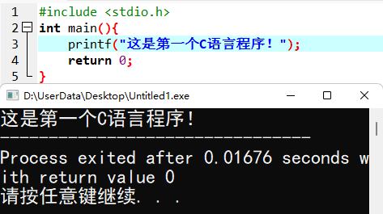
4. **第四行**
   return 表示函数的结束，main函数到此就结束了，因为我们程序也是从main函数开始从main函数结束的，所以**main函数中的return也是表示程序的结束**
5. **拓展：**
   可以看到第四行分号结束有//，这个其实是一个注释的作用，程序运行时不会执行注释的内容。
   //：单行注释
   /* */：多行注释

**1.4 C程序的运行环境**
[devc++编译器下载地址](https://sourceforge.net/projects/orwelldevcpp/)

*至此，第一章的内容就完结了(未完待续...)*


## 第二章 数据类型与表达式
**2.1 C语言基本字符集和单词**
*2.1.1 C语言基本字符集*（P0）
C语言的基本字符集是ASCII编码：
 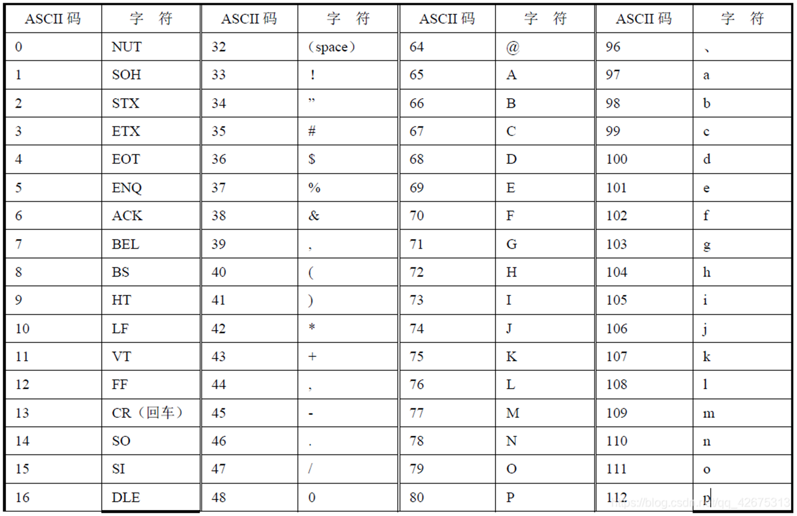
这个表重点记A、a、0这三个字符的编码，**A对应65，a对应97，0对应48**，因为知道了A的编码65也就知道了B的编码就是65+1=66，以此类推。
**重点：大写字母与小写字母中间相差32，例如A是65，a是97，97-65=32**

*2.1.2 单词*（P0）
1. 关键字：
   C语言中关键字众多，目前为止我们学习了char、double、float、int、return、等关键字
   **关键字是C语言预先声明定义好的，我们不可以对其进行重新的定义**
   注意**C语言是区分大小写的**，也就是说CHAR和我们的关键字char其实是两个东西
2. 标识符：
   标识符就是我们可以定义的程序对象，比如变量名、函数名
   标识符可以**由数字、字母、下划线组成，注意数字不可以开头，并且不能包含特殊字符**
```
   8p       不合法：数字不能开头
   p！8     不合法：包含了特殊字符
   INT      合 法
   int      不合法：int是关键字
   _max     合 法
   printf   合 法但没必要:printf原本用于打印，重新定义会丧失打印功能，得不偿失
```
**2.3 常量**
**常量就是其值不会发生改变的量**
*2.3.1 整型常量*（P0）
1. **十进制整数**：例如：145、486等
2. **八进制整数**：需要在前面加0，注意写八进制整数常量时不要大于8，例如：017、05等
3. **十六进制整数**：需要在前面加0x，例如0x1A、0xFF等
*以上的写法都可以表示C语言中的整型常量*

*2.3.2 浮点型常量*（P0）
1. **十进制数形式**：例如：3.14159、0.12等都是浮点型常量
2. **指数形式**：
   *例如：2.56e2，它的值其实就是2.56 * 10的2次方，也就是256
   256e-2就等于256 * 10的-2次方，也就是2.56*
   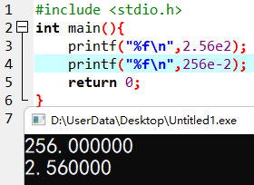

*2.3.3 字符型常量*（P0）
**字符型常量是用单引号表示**的，例如：
```C
   'a' , 'b' , '\'' , '\\'
```
1. **字符型常量占一个字节**
2. **字符型常量中间只能有一个字符**
3. **注意：在C语言中 \ 起到转义的效果，在字符常量中使用单引号或者 \ 时需要写成上述代码的效果**
拓展：
```c
   '\n' //换行
   '\t' //制表符 类似于键盘上的Tab
   '\a' //响铃效果 等等等~
   '\b' //退格效果，类似于键盘上的Backspace键
```
*2.3.4 字符串常量*（P0）
字符使用单引号表示，对应的**字符串就会使用双引号**表示
字符串所占的字节是不固定的，这取决于双引号中的内容有多少
注意字符串会默认补充一个 \ 0 来表示字符串的结束
例如：
```
   "abcdef"  //可以看到双引号中有6个字符，应该是6个字节，实际上是7个字节，因为还有\0表示结束
```

*2.3.5 符号常量*（P1）
除了C语言认识的这些常量以外，我们自己也可以**定义常量**
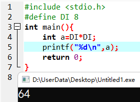
可以看到*DI就被当作一个常量8*来进行使用了

**2.4 变量**（P0）
变量就是其值在程序中可能发生改变的量
1. **整型变量**
   定义整型变量可以使用 **int 关键字**，或者short、long、unsigned int都是可以的，他们的区别主要是**取值范围的不同**
   常见的int就可以覆盖绝大多数环境了，例如：
   ```C
      //这行的意思就是在内存中定义了两块空间，一块空间称为a，一块称为b，这两个空间里只能存放整数
      int a,b;  
   ```
   int到底给我们申请了多大的空间呢？
  **int给我们申请了4个字节的空间**
整型变量进行输出需要使用格式化输出符号 %d 例如：
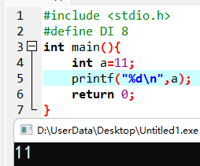

2. **浮点型变量**
   定义浮点型变量可以使用**float关键字**，或者double、long double，他们的区别也是取值范围不同
   **float同样给我们开辟了4个字节的空间**，**%f是它的格式控制符**，例如：
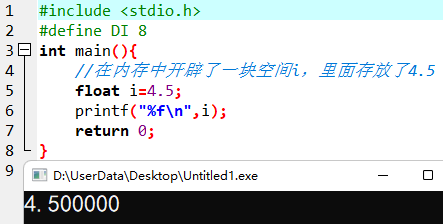
3. 字符型变量
   定义字符型变量可以使用**char关键字**，或者unsigned char，他们也是取值范围的区别
   **char 给我们开辟了1个字节的空间去存放数据，%c是它的格式控制符**，例如：
 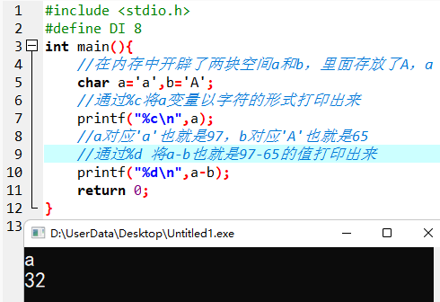

**2.5 运算符与表达式**
*2.5.1 算数运算符和算数表达式*（P0）
1. -：减法运算符，用于计算两个数的差
2. +：加法运算符，用于计算两个数的和
3. *：乘法运算符，用于计算两个数的乘积
4. /: 除法运算符，用于计算两个数的商
5. %：取余运算符，用于计算两个数相除之后的余数
6. +、-：用于表示一个数是正数还是负数
例如：
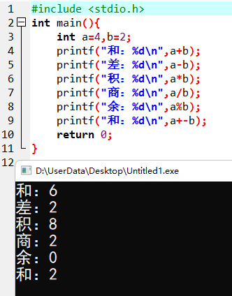
注意：C语言中整数相除还是整数，例如5/2在C语言中其实是2而不是2.5
如果想得到精确的保留小数位的值在定义的时候可以使用float定义，例如：
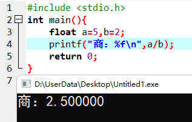

**混合运算（优先级）：**（P0）
第一级：（）
第二级：+ - //注意这里的+ -表示正负
第三级：* / % 
第四级：+ - //这里的+ - 表示加 减
**常考题：**
```C
#include <stdio.h>
int main(){
	int a=8;
 	a*=10 + 8 - 4 * 3 + 24 / 5 *(6 + 3);
	printf("%d",a);
	return 0;
}
```
计算步骤如下：
```C
a*=10 + 8 - 4 * 3 + 24 / 5 *(6 + 3);//第一步
a=a*(10 + 8 - 4 * 3 + 24 / 5 *(6 + 3));//第二步
a=a*(10+8-12+4*9);//第三步
a=8*42;//第四步
a=336;//第五步
```
**自增、自减运算符**
1. ++（前缀自增）：在本条语句中就使用加一之后的值
2. --（前缀自减）：在本条语句中就使用减一之后的值
3. ++（后缀自增）：在下一条语句中使用加一之后的值，本条语句暂时使用未加一的值运算
4. --（后缀自减）：在下一条语句中使用减一之后的值，本条语句暂时使用未减一的值运算
例如：
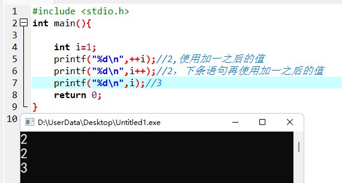

*2.5.2 赋值运算符和赋值表达式*（P0）
**= 就是我们的赋值运算符，用于将等号右边的值赋予给左边**
```C
   a=8;//将8赋予给a，a里面就存放了8
```
除此之外还有+=、*=、%=等运算符
```C
   int a=8;
   a*=8;//这个写法就类似于a=a*8,最后计算结果是8*8=64
```
**赋值表达式**
右边不仅可以是8，也可以是一个表达式，例如：
```C
   int a=8;
   a*=(9-5)*4;//这就类似于a=a*((9-5)*4)这种写法，结果是128
```
*2.5.3 逗号运算符和逗号表达式*（P1）
逗号运算符用于返回最后一个逗号后面表达式的值
例如：（a=9，b=6，c=15），这个表达式为15
```c
int x=4；
(x=8 * 2,x * 4),x*2;
//这个表达式的值为32，计算8*2的值赋予x，x存储了16，16*4等于64，
//也就是(x=8 * 2,x * 4)返回的值是64，但是后面还有，x*2，x的值是16，16*2是32
//因此整个表达式(x=8 * 2,x * 4),x*2的值是32
```
*2.5.4 条件运算符和条件表达式*（P1）
一般格式：
表达式1？表达式2：表达式3
**如果表达式1成立执行表达式2，如果表达式1不成立执行表达式3**
*例如：设计一个C语言程序用于计算两个整数的相加，这两个数需要用户进行输入（scanf），
	最后计算出的结果如果大于或者等于30打印：“该数大于或者等于30，结果是：%d”，
	否则如果小于30，打印：“该数小于30，结果是：%d”*
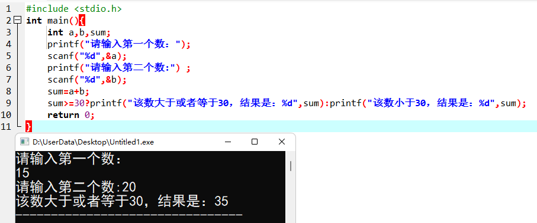

**2.6 指针**
**指针是C语言的灵魂，C语言为什么难？这都离不开指针**
认识指针之前先认识一下地址，什么是地址呢，C语言在定义变量时会为大家分配一块空间。
例如：
```c
   char a='e';//这就是在内存中定义了一块内存空间，它的名字是a，里面存放的是字符e
```
地址就是定义的这块空间的门牌号码，它的用途就是找到这块区域，例如我们可用在一栋楼中通过教室的门牌号码找到这间教室
*2.6.1 什么是指针*
什么是指针呢？
**指针是一种数据的类型，具有指针类型的变量称为指针变量**
**指针变量中就是用来存一块空间的地址的，例如上述代码中a变量的地址就可以存放在指针变量中**

*2.6.2 指针变量的定义*
那知道了指针变量和指针，在C语言中是如何定义指针变量的的呢？
```c
   int * p;//其中int *就是用来定义指针类型数据的，而p代表的就是指针类型变量，p就是用来存放整型变量地址的
   char * q;//q是用来存放字符型变量地址的
   float * t;//t是用来存放浮点型变量地址的
```
*2.6.3 指针运算符*
1. & 取地址符
   这是用来取出变量的地址的符号
2. * 访问运算符
   *符号作用是通过地址找到变量所在的位置的值
因此我们代码可用这么写：
```c
   int * p;//定义一个指针变量存放整型变量的地址
   int a=3;//定义一个整型变量,里面存放的是3
   p=&a;通过取地址符得到a变量的地址，将这个地址给了p这个指针变量
   printf("%d",*p);//通过访问符，对p里面存放的值也就是a的地址找到这个地址所对应的那一块空间里面的值，也就是3，将3打印出来了

```
*2.6.4 指针变量的初始化和运算*
和正常变量初始化一样，指针变量也可以进行初始化，并且也可以同时定义多个指针变量
```c
   int a;
   int * p=&a,*q;//可用在定义这个指针变量的时候就对p赋初值（a的地址），也可以同时定义多个指针变量
```

思考：两个指针可以进行加减乘除吗？
* 两个指针可以想减，就像这栋楼的两个门牌号一样，相减可以计算出他们之间的距离
* 两个指针相加、乘、除没有意义

练习：通过指针交换a，b的值？
```c
#include <stdio.h>
int main(){
   int a=3,b=5,t;
   int *p,*q;
   p=&a,q=&b;
   t=*p,*p=*q;*q=t;
   printf("a=%d b=%d",a,b);//这样就通过指针将a和b的值给交换了
   return 0;
} 
```