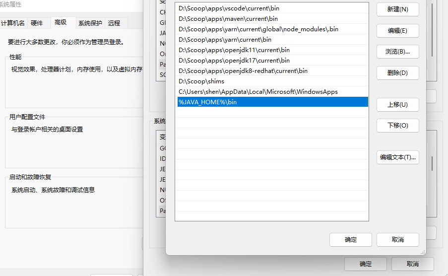

---
## 前言
快速过度完前中期，避免重建新号，纯0基础。
### 前期准备
1. #### 环境准备
   * **Java环境安装：**
     在这个链接中选择你需要的[JDK安装](https://www.oracle.com/cn/java/technologies/downloads/archive/)版本叭~
    
    
    下载好后傻瓜式下一步安装，路径选择D盘。
    环境配置：
    进入刚刚下载好的文件夹，复制路径：
    
    在系统的环境变量中添加JAVA_HOME,然后将复制的路径粘贴进变量值:
    
    在系统变量或者用户变量中的path中添加（系统变量就是为所有用户添加环境，用户变量就是为当前用户添加）：
    
    重启电脑后，打开终端，输入：java -version，查看安装成功：
    
    * **[Maven下载](https://maven.apache.org/download.cgi)**
    环境配置也大差不差，无非就是bin目录搞到系统环境变量下...
    * **数据库配置：**
    这里以常见的mysql为例，[MySQL下载](https://dev.mysql.com/downloads/mysql/)
    这里建议使用zip版,
    
    解压后放到D盘，环境配置类似于jdk的环境配置。
    
    但是MySQL需要配置my.ini文件，配置完了还需要启动服务，修改密码...
    详细可查看[这一篇文章](https://blog.csdn.net/atu1111/article/details/105183536)
    不禁思考...这样配置是否过于麻烦还容易出错，这里推荐使用Windows包管理工具Scoop下载。Scoop的使用前面的文章介绍过。
2. #### 工具准备
   [Idea](https://www.jetbrains.com/zh-cn/idea/download)：
   Java编译器首选，强大的插件库，代码分析和调试，对Java的支持极其友好。
   [Navicat](https://navicat.com.cn/products)：
   强大的数据库管理工具，支持多种数据库，其实对我来说就是功能强大，对新手友好。
   但是这两款工具都收费...,当然我们肯定白嫖~，文末附上破解包...
3. #### 项目准备
   这里推荐使用maven作为项目管理工具：

    随便选一点基础需要的依赖，他会自动在pom中添加，当然遗漏了也没关系，可以在这里查询添加[Maven依赖库](https://mvnrepository.com/)
    
    OK确定，idea会给你生成一个spring boot项目。
    然后我们打开idea设置：点击项目构建，点击maven，我们配置以下本地的maven仓库路径，不然它会自动去网上下载，速度慢的嘞~
    
    如果遇到maven插件爆红，可以跳转至[此处](https://www.bidii.love/2023/10/14/%E8%B8%A9%E5%9D%91%E6%97%A5%E8%AE%B0/%E8%B8%A9%E5%9D%91%E6%97%A5%E8%AE%B0%EF%BC%88%E6%9C%8D%E5%95%A6%EF%BC%81%EF%BC%81%EF%BC%81%EF%BC%89/)
    
### 项目结构
    好啦，基础配置结束，我们来认识一下项目结构叭 ~

项目基本结构：
|目录名称|位置|作用|
|:---:|:---:|:---:|
|.idea|项目名称/.idea|保存 IntelliJ IDEA 编辑器的项目配置信息的目录|
|.mvn|项目名称/.mvn|将依赖包下载到本地仓库中，以供项目中其他模块使用|
|src|项目名称/src|存放项目源码|
|target|项目名称/target|存放 Maven 构建生成的文件，例如最后生成的项目jar包就在此处|
|pom.xml|项目名称/pom.xml|maven依赖配置文件|
|README.md|项目名称/README.md|项目说明文档，存放作者的胡话|

* SRC代码设计结构：我们一般遵循Controller-Service-Dao的设计模式：
* controller：控制器，负责接收用户请求，并将请求转发到相应的服务层
* service：服务层，负责业务逻辑处理，调用Dao层
* dao：数据访问层，负责与数据库交互，完成对数据的增删改查
* pojo：数据库的一张表对应一个pojo层，并且表中所有字段都在pojo层都一一对应
写代码时一般先从pojo层写起，pojo——>dao——>service——controller
### 连接数据库
    在此之前，我们最好设置一下mysql的密码，避免报密码为空的错误。
    ```
    mysql -uroot -p password
    ```
    idea连接数据库：

### 配置application.properties

```
server.port=8080
spring.datasource.driver-class-name=com.mysql.cj.jdbc.Driver
spring.datasource.url=jdbc:mysql://localhost:3306/你数据库名字?useUnicode=true&characterEncoding=UTF-8&useSSL=false
spring.datasource.username=root
spring.datasource.password=password
mybatis-plus.configuration.log-impl=org.apache.ibatis.logging.stdout.StdOutImpl
```
### 结语
    接下来就是在src中编写源码啦~开发愉快~
idea破解：
https://pan.baidu.com/s/17IeA1F6FFeYqW2lJ_LU3AQ  密码：1tpc
navicat破解：
https://www.cnblogs.com/kkdaj/p/16260681.html