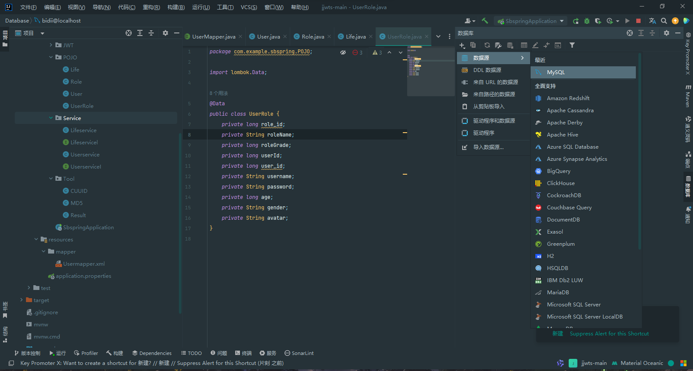
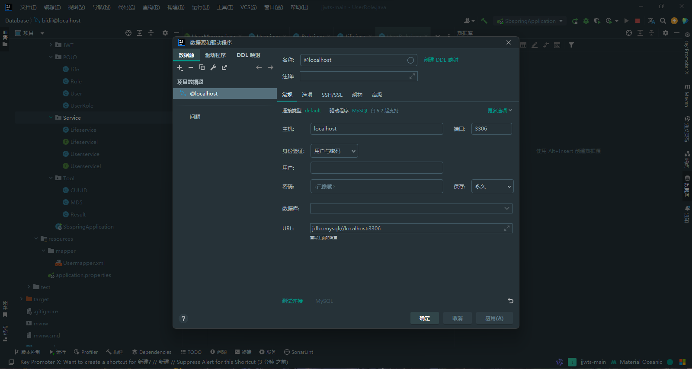
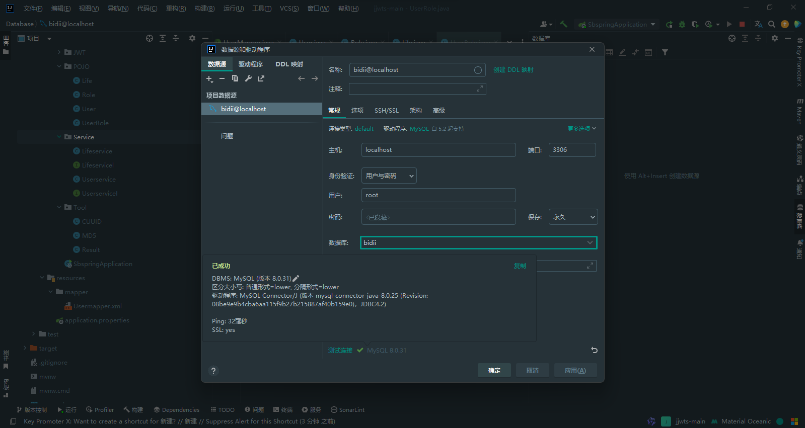
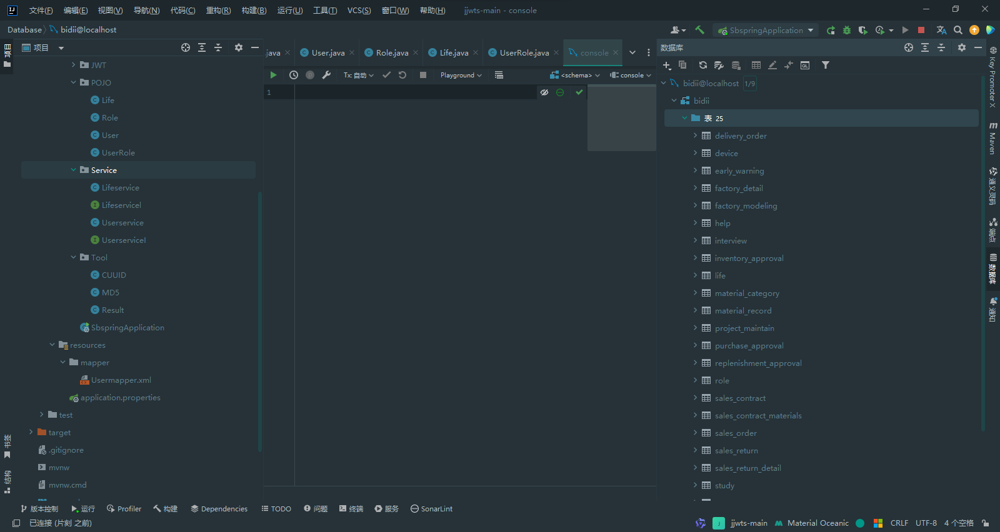
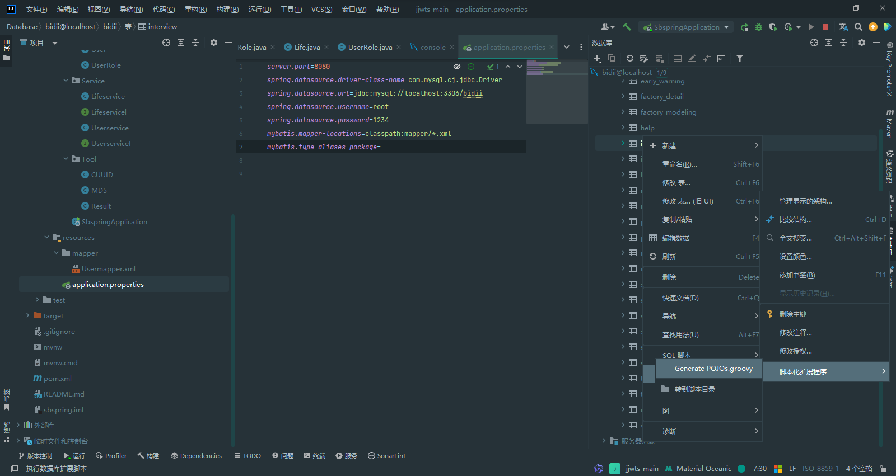
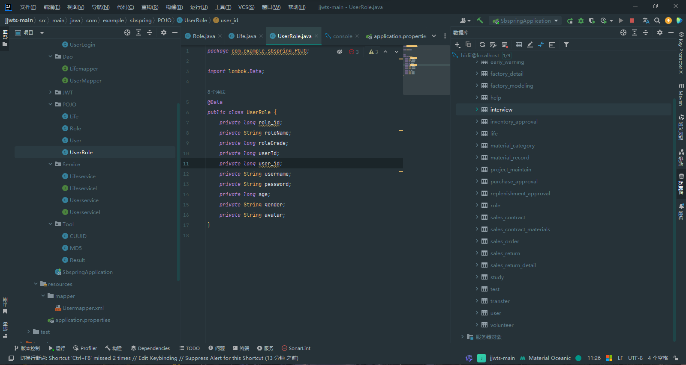
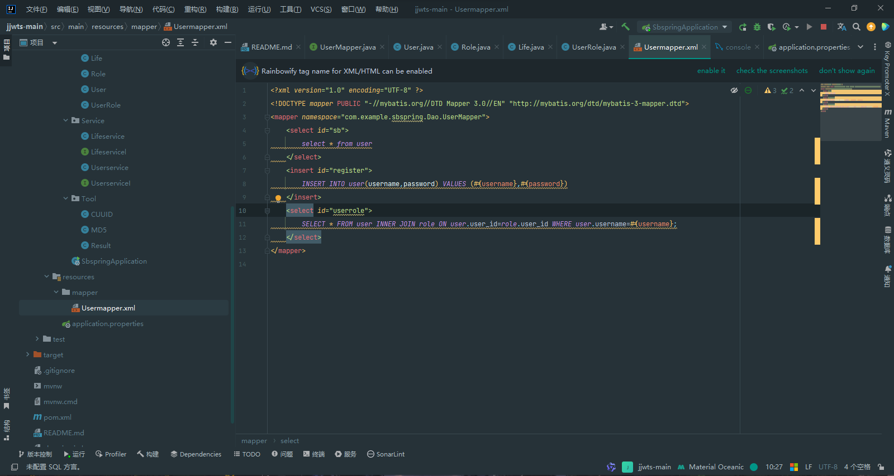

## 前言
没错我们还在新手村，在[第一篇文章](https://www.bidii.love/2023/10/31/code_here/springboot/")中我们学习了做项目前置的基本配置，比如maven配置，jdk配置,并且还对项目目录的各个结构进行了分析
### 实体层
拿到一个空项目我习惯先将设计好的数据库进行映射：
1. 连接数据库
   点击IDEA右侧数据库选项，应该每一个版本都在这个位置，至少我用过的是这样。
   
   然后你就会进入到idea内置的连接数据库的界面，简单配置好账号密码后，记得一定要点测试连接，成功了再确定，盲目确定会引起不必要的报错
   
   
   当当当~数据库中的表就同步到idea中了
   
2. Idea中application.properties配置
   ```
    server.port=8080    //项目启动端口号，启动完毕可通过localhost：8080访问
    spring.datasource.driver-class-name=com.mysql.cj.jdbc.Driver  //数据库驱动必填
    spring.datasource.url=jdbc:mysql://localhost:3306/**你自己数据库的名称**/   //数据库连接地址
    spring.datasource.username=root //数据库用户名
    spring.datasource.password=你的密码  //数据库密码
    mybatis.mapper-locations=classpath:mapper/*.xml  //mybatis的映射文件路径，也就对应了resources目录下的mapper文件夹
    mybatis.type-aliases-package=com.example.sbspring.POJO  //mybatis的别名包路径

   ```
3. POJO
   我们在com.eample.项目名称 下面创建一个目录POJO
   好的基本项目配置完毕，实体层也就是我们的POJO层，需要映射数据库数据了，这里推荐下载依赖Lombok插件，可以自动生成get set方法，并且可以减少代码量。
   手敲实体类代码属实麻烦，这里推荐使用脚本序列化程序，每个idea位置不一样，可以找一下
   
   OK实体类就创建好了，这里我删除了生成的get和set，因为我们用了Lombok
   
至此数据库实体类就做完了
### 持久层
在上面我们也配置了mybatis，这就是操作我们的数据库的ORM，其实我更推荐使用Spring Data JPA，但大环境驱使下我们还是用mybatis来记录。
我们在com.eample.项目名称 下面创建一个目录DAO也可以是Mapper
如果使用mybatis的话写SQL就有两种方法，第一种就是在mapper文件夹下新建xml文件，第二种就是使用java API，他们可以共存
讨厌xml！！！！xml就是这个世界上最该被淘汰的东西。
大概就张这样：其实也不复杂，但总觉得不在写java，这里不做详细的介绍

累了.....停跟十个月...
累了.....停跟十个月...
累了.....停跟十个月...
累了.....停跟十个月...
累了.....停跟十个月...
md更写错了草！