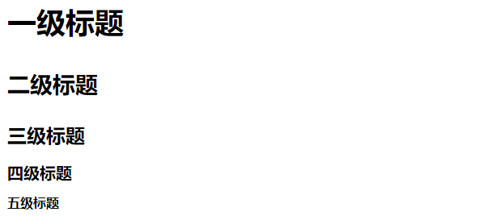
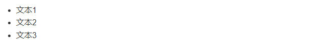
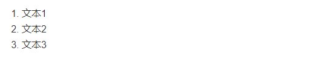
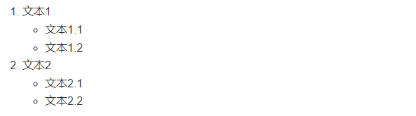
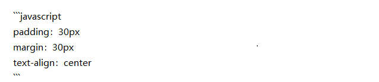

## 前言
最近复习了一下markdown语法，发现有的语法忘记了，倒不如索性写一篇博客来记录一下，以后也可以作为备忘录来使用。
### 1.标题
标题是每篇文章都需要也是最常用的格式，在Markdown中，如果一段文字被定义为标题，只要在这段文字前加#号即可。
```
# 一级标题
## 二级标题
### 三级标题
#### 四级标题
##### 五级标题
```
效果如下：

例如前面的**前言**二字就是二级标题、前面的**1.标题**就是三级标题。
### 2.列表
#### 2.1无序列表
无序列表用- + * 任何一种都可以，个人喜欢使用 *，记得要在符号后面加空格。
```
* 文本1
* 文本2
* 文本3
```
效果如下：


#### 2.2有序列表
有序列表是使用数字加点的方式，记得点后面要加空格，否则是普通数字。
```
1. 文本1
2. 文本2
3. 文本3
```
效果如下：


#### 2.3列表嵌套
上一级和下一级之间敲三个空格即可。
```
1. 文本1
   * 文本1.1
   * 文本1.2
2. 文本2
    * 文本2.1
    * 文本2.2
```
效果如下：


### 3.引用
在引用的文字前加>即可。引用也可以嵌套，如加两个>>三个>>>n个...
```
> 引用1
>> 引用2
>>> 引用3
```
效果如下：
> 引用1
>> 引用2
>>> 引用3


### 4.图片与链接
#### 4.1图片
插入图片的语法和插入链接的语法很像，区别在一个!号。
```

```
在hexo博客中图片写法可能有所不同，详细可参考我的第一篇文章[Hexo搭建博客](https://www.bidii.love/2023/04/23/myhexo/)后面的问题解答。
#### 4.2链接
它可用于在你的文章中插入蓝色文字，点击可进行跳转：
```
[链接名称](链接地址)
```
例如：
```
[笔蒂I的博客](https://www.bidii.love)
```
效果如下：
[笔蒂I的博客](https://www.bidii.love)

### 5.粗体与斜体
#### 5.1粗体
要加粗的文字左右分别用两个*号包起来，可用于强调文字
```
**这是粗体**
```
效果如下：
**这是粗体**
#### 5.2斜体
要倾斜的文字左右分别用一个*号包起来，可用于强调文字
```
*这是斜体*
```
效果如下：
*这是斜体*

注意：**和*要分开使用，不能混合使用，否则会失效。**
注意：***后面不用加空格，否则会失效或者变成无序列表。**
#### 5.3删除线
在需要添加删除线的文字前后各加两个~~即可。
```
~~删除线~~
```
效果如下：
~~删除线~~

### 6.表格
表格是我觉得最麻烦的一个语法了，因为要记住好多符号，不过用的时候也不多，所以也没什么关系。
```
|表头1|表头2|表头3|
|:---|:---:|---:|
|左对齐|居中对齐|右对齐|
|左对齐|居中对齐|右对齐|
```
效果如下：
|表头1|表头2|表头3|
|:---|:---:|---:|
|左对齐|居中对齐|右对齐|
|左对齐|居中对齐|右对齐|

### 7.代码
#### 7.1单行代码
代码之间分别用一个反引号包起来
```
`Hello World`
```
效果如下：
`Hello World`
#### 7.2多行代码
代码之间分别用三个反引号包起来(反引号在键盘esc键下面)
这里要注意的是，三个反引号后面可以加上语言名称，这样可以实现代码高亮：

效果如下：
```javascript
padding：30px
margin：30px
text-align：center
```

### 8.分割线
分割线的语法只需要三个*号即可：
```
***
```
效果如下：
***

### 9.转义
在Markdown中，如果你想要显示特殊字符，比如说你想要显示星号，那么你可以在前面加上反斜杠，使其变成普通字符。
```
\*
```
效果如下：
\*

### 10.上下标
上标：用^包起来，下标：用~包起来
```
x^2^ x~2~
```
效果如下：


### 语法高亮
***(不建议使用这个，可使用第3点进行代替)***
``` 
==www.bidii.com==
```
效果如下：

标注：可以在vscode中安装markdown插件，这样就可以实时预览了
然后像加粗可以快捷键ctrl+b，斜体可以ctrl+i...
学到这里日常写笔记写博客完全*够用*，如果还想精通markdown更加高级的语法，可以参考[Markdown语法手册](https://markdown.com.cn/)。
