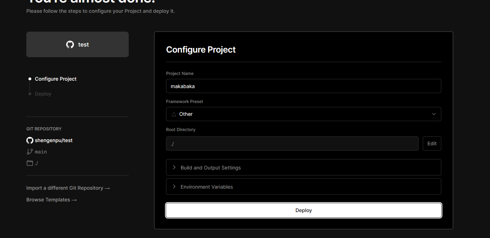

## 使用Hexo搭建博客
整个过程，从部署到上线完全免费，属实让人泪目...
### 前期准备
1. **git**
   版本控制工具，我们使用它来对我们的博客文章进行推送，使用方法其实很简单，我们常用的也就几个命令,后面会说到
   
   安装地址：https://git-scm.com/book/zh/v2/%E8%B5%B7%E6%AD%A5-%E5%AE%89%E8%A3%85-Git
   安装完成后，右击本地文件夹出现Git Bash就算成功了
2. **github**
    用于存储文章的仓库，如果还没有账号的可以免费注册一个,当然它需要科学上网，如果没有，使用gitee也是可以的，方法都差不多
    
    访问地址: www.github.com
3. **vercel**
   vercel网站提供免费的网站托管服务，很多小伙伴像我一样苦恼于部署一个自己可访问的站点，购买域名，购买服务器，配置nginx，你还得熟悉一下Linux别提有有多复杂了，但是vercel就可以解决你讨厌的这一系列问题
   
   访问地址: https://vercel.com/
4. **node.js**
   我们下载node，其实不是需要使用node，只需要其中的npm命令行工具就可以了,下载完自己电脑终端输入node -v，如果能显示版本号其实就没什么问题了
   访问地址: https://nodejs.org/en
ok，大概就这么多,如果你有scoop包管理工具的话，可能会更快
### 具体实现
1. **本地hexo配置**
   电脑终端输入
   ``` 
   npm install -g hexo-cli
   ```
   使用`hexo -v`能看到版本号就没啥问题了
   我们在本机电脑上新建一个文件夹，用于存放你的博客项目
   终端cd到这个文件夹目录下，比如d盘下面的test文件夹，那命令就是`cd d:\test`
   在这个文件夹下，执行`hexo init`,那这个文件夹就初始化成为了一个基于hexo的博客项目了
   同样是这个文件夹下，执行`git init`，那这个项目就变成了可以上传的博客项目了
2. **在github上创建一个仓库**
   
   里面的Repository name随便起个名字，然后权限设置public或者private都是可以的，然后直接完成创建，这样你就有一个属于你装博客文章的仓库了  
   然后你就会得到如下界面：
   
3. 使用git提交博客项目到我们刚刚的仓库
    我们在博客文件夹下右击使用 Git Bash打开git的终端
    依次执行
    ``` git init  
        git add README.md
        git commit -m "first commit"
        git branch -M main
        git remote add origin '你自己仓库生成的https/'
        git push -u origin main 
    ```
    刷新github界面，变成这样子就算提交成功了
    
4. 购买域名，我使用的是万网，因为正式用户可以免费用域名一年
   域名部分我就不多赘述了，网上教程有很多
5. 使用vercel挂载仓库
   在这里找到你刚刚的仓库import就可以了
   
   在这里没啥问题直接Deploy，有可能会提示名字的报错，我们换个名字就可以
   
   成功后看到这个界面，没看到点击头像下的Dashboard然后选中我们的项目即可，这里我已经挂载好了，正常流程可能有所不同
   
   依次点击此界面的setting->Domains，填入刚刚购买好的域名并且Add
   
   我们可以看到红了，这是因为没有解析域名，阿里云是这样解析的
   
   解析完成后，我们在vercel刷新界面，就可以看到刚刚的报红没了
   
至此，所有搭建的工作就完成了
### 搭建完成
浏览器输入我们的域名就能访问到我们的博客啦


### 关于搭建博客的一些问题
1. 图片加载问题
   这也是很多很多小伙伴最头疼的一个问题,其实有一种很简单的方法，并不需要下载什么插件（虽然说我是下插件解决的，但后来发现了更简单的方法）
   * 首先我们修改我们的_config.yml文件
   ```
   post_asset_folder: true
   ```
   * 然后我们执行`hexo new post "文章名字"`，这样就会在source/_posts文件夹下生成一个md文件和一个同名的文件夹
   * 我们将生成的文件夹拖到上一级目录，也就是source下面，而md文件还是放在_posts文件夹下
   * 将图片放到刚刚的文件夹下（文件名一定要用字母表示，且最好是.png图片，否则都有可能加载失败）
   * 在md文件中插入图片的时候，使用``这样就可以了，而且我试了一下就算打\也是可以出来的
   * 终端输入`hexo clean && hexo g && hexo d`，然后刷新你的博客就可以看到图片了
   * git对其进行推送
      ```
      git status
      git add *
      git commit -m "提交信息"
      git push
      ```
   * 输入你的域名就可以看到图片了