## 前言
最近心血来潮想试一下python，因为之前写过别的语言，所以python的基础语法还是很快就能上手的，于是我花了半天学习了一下python基础的语法,编译器我选择的是pycharm。然后python环境安装好了就可以开始我们的python之旅了。
### 1.创建项目
打开pycharm，点击create new project，然后选择项目的存放路径，然后点击create即可。
这里解释器我选择的是python3.7，因为我之前安装了python版本是3.7，所以这里就选择3.7了。
正常不会有啥问题，但要注意给足python的权限，不然会报错（不过正常遇不到）
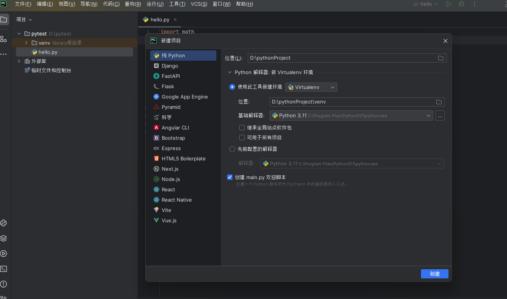
### 1.变量及数据类型
*python中的变量不需要声明，直接赋值即可，变量类型也不需要指定，python会自动判断变量类型。*
比如’a=1’，python会自动判断a为整型（int）。
比如’a=1.0’，python会自动判断a为浮点型（float）。
比如’a=’hello’，python会自动判断a为字符串（str）。
比如’a=True’，python会自动判断a为布尔型（bool）。
比如’a=None’，python会自动判断a为空值（NoneType）。
> 标注：这个None就可以用在比如有的时候我们不知道变量确切的类型，但是又想初始化一个变量，这个时候就可以用None来初始化。
### 2.输入输出
python中的输入输出函数分别是input()和print()。
input()函数用于接收用户输入的内容，返回值为字符串类型。
print()函数用于输出内容，可以输出字符串、数字、变量等。
### 3.强制类型转换
python中的强制类型转换函数分别是int()、float()、str()、bool()
很明显就是将你想要转换的内容放在括号内转成对应的类型。
例如input()函数用户键入完成之后返回的是字符串类型，如果我们想要将其转换成整型，就可以使用int()函数。
### 4.type()函数
type()函数用于查看变量的类型，返回值为变量的类型。
### 5.注释
python中的注释分为单行注释和多行注释。
单行注释使用#号，多行注释使用三个单引号或者三个双引号。
**以上五点每门语言都有，我用一个例子全都举例了一下，如下图：**
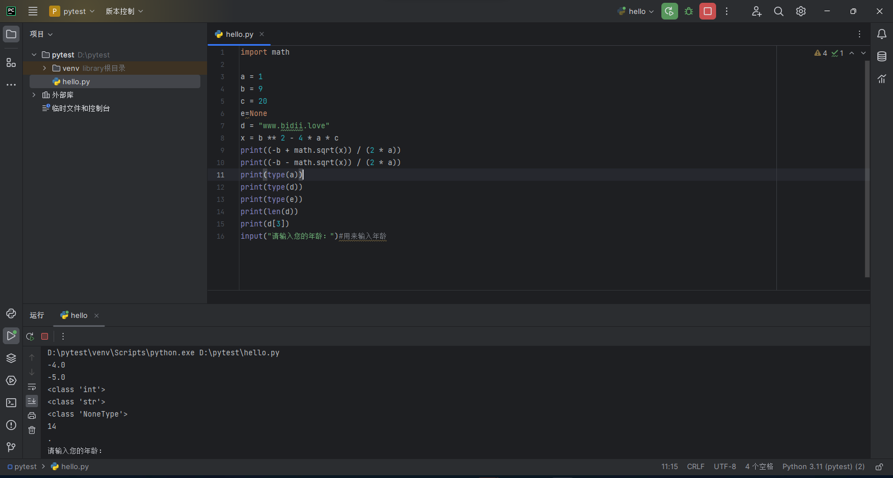
### 判断语句
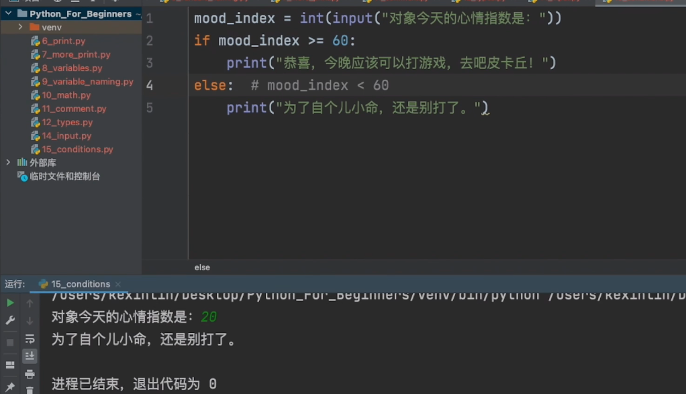
在python中缩进很重要，因为在python中条件判断并没有用大括号来表示，而是用缩进来表示的，例如：
错误写法：
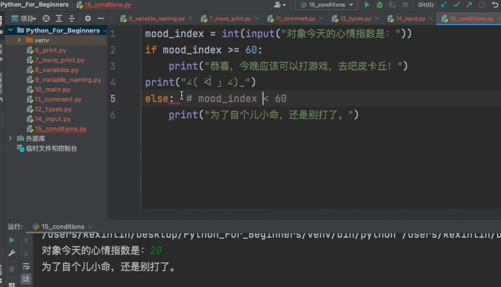
正确写法：
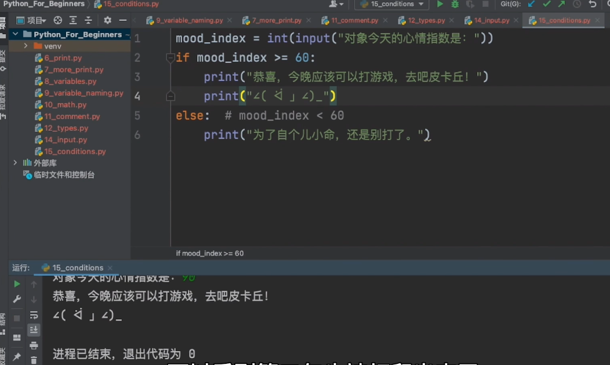
举个例子吧，其实和别的语言大差不差，熟悉一下写法即可
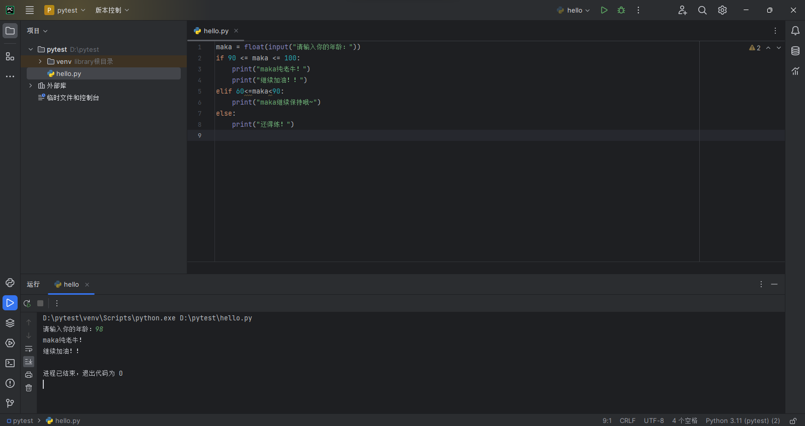
match...case...语句
```python
def http_error(status):
    match status:
        case 400:
            return "Bad request"
        case 404:
            return "Not found"
        case 418:
            return "I'm a teapot"
        case _:
            return "Something's wrong with the internet"

mystatus=400
print(http_error(400))
```
case_相当于C语言中的default
由于我们参数是400，所以返回的是Bad request
### 与或非
在python中与或非分别是and、or、not
and：与 两个条件都满足才为真
or：或 两个条件满足一个就为真
not：非 取反
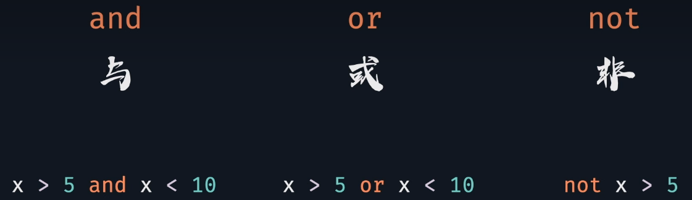
可以通过返回的真假和上面的判断语句结合使用
### 列表
列表是python中最常用的数据类型，列表中的元素可以是任意类型，列表中的元素可以是重复的，列表中的元素是有序的。
基本上大差不差举个例子带过吧~
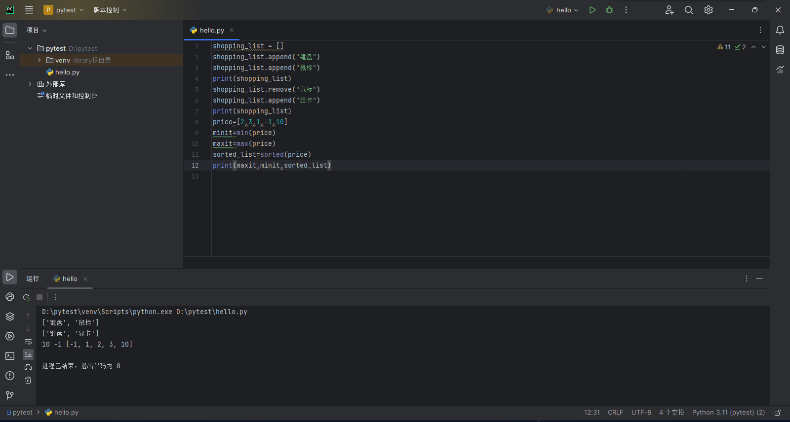
### 字典
字典是python中的另一种数据类型，字典中的元素是无序的，字典中的元素是键值对的形式存在的，字典中的键是唯一的，字典中的值可以是任意类型，字典中的键是不可变的。
以下是字典的例子，很像json格式，但是不是json格式，json格式是字符串，而字典是python中的数据类型。
**字典取值的时候是通过键来取值的，例如dict["小猪"]，这样就可以取到小猪的值了。**
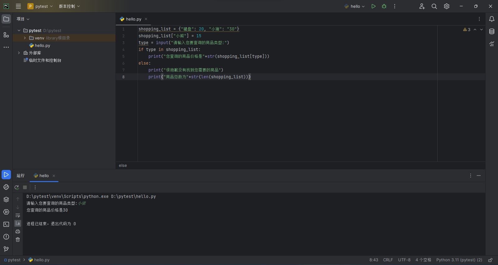
字典的增删改查
例如有这样一个字典
```python
dict={"小猪"：20,"小狗"：30,"小猫"：40}
```
增加
```python
dict["小鸡"]=50
```
删除
```python
del dict["小猪"]
```
修改
```python
dict["小狗"]=60
```
查询
```python
dict["小猫"]
```
补充清空字典和删除字典
```python 
dict.clear()
del dict
```
___
.keys()方法用于返回字典中的所有键，返回值为列表类型。
.values()方法用于返回字典中的所有值，返回值为列表类型。
.items()方法用于返回字典中的所有键值对，返回值为列表类型。
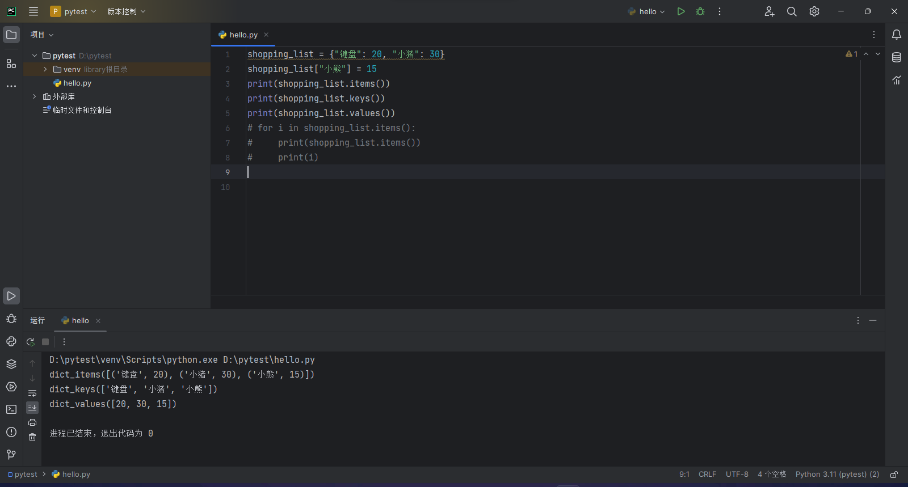
### 循环语句
python中的循环语句分为for循环和while循环。
for循环：用于遍历序列或者集合，例如列表、元组、字典、字符串等。
while循环：用于循环执行程序，一般用于死循环。
#### for循环
for循环的语法格式如下：
```python
for 变量 in 序列：
    代码块
```
举例：
```python
list=[1,2,3,4,5]
for i in list:
    print(i)
```
题目：打印出所有体温大于37.3的人
```python
dict={"小猪":37.2,"小狗":37.4,"小猫":37.5}
for i in dict:
    if dict[i]>37.3:
        print(i)
```
##### range()函数
range()函数用于生成一个整数序列，返回值为range类型。
range()函数的语法格式如下：
```python
range(start,stop,step)
```
start：指定生成整数序列的起始值，默认为0。
stop：指定生成整数序列的结束值，不包含该值。
step：指定生成整数序列的步长，默认为1。
#### while循环
while我觉得比较适合来做死循环->
while循环的语法格式如下：
```python
while 条件：
    代码块
```
题目：求出所有添加进来的数的平均数
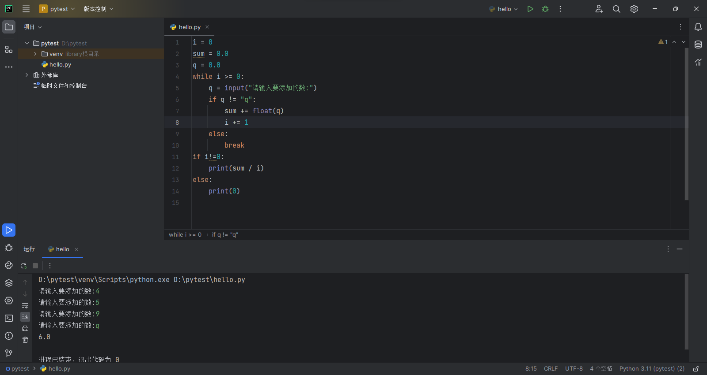
### format()函数
format()函数用于格式化输出，返回值为字符串类型。
format()函数的语法格式如下：
```python
format(value,format_spec)
```
{}里的数字表示format()函数中的第几个参数，从0开始。
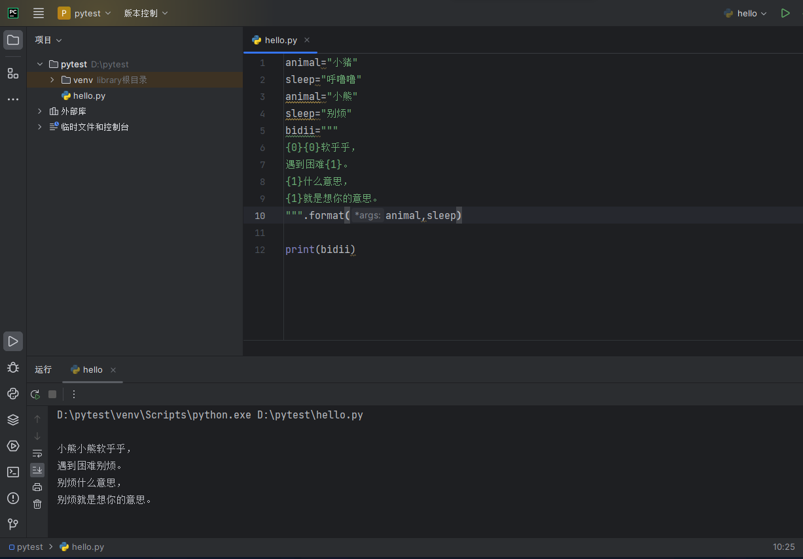
也可以通过关键字参数来指定参数的位置
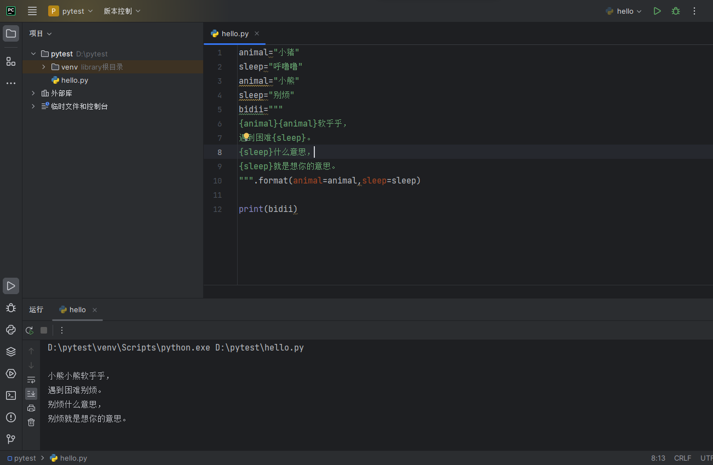
当然format也可以用在格式化输出字典上
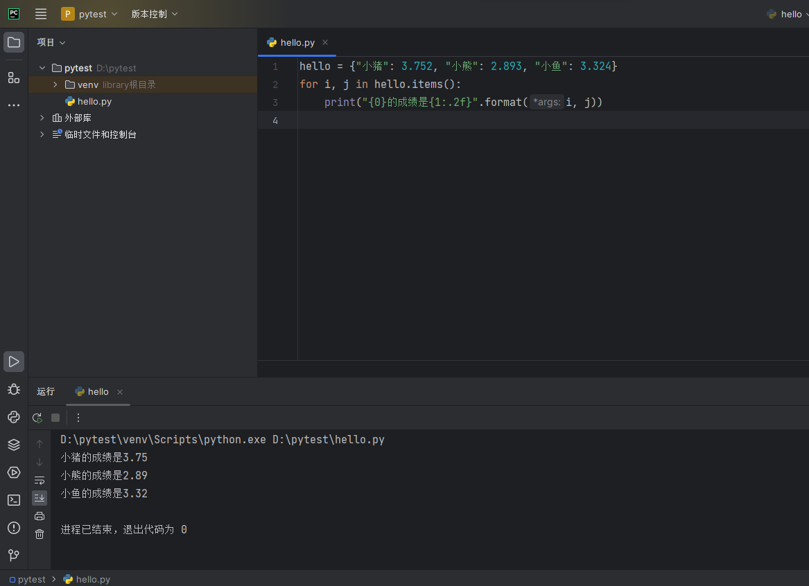

### 函数
函数是python中的一种代码组织形式，函数可以提高代码的复用性，函数可以提高代码的可读性，函数可以提高代码的可维护性。
没啥好说的，换了种写法**def 函数名（）：代码块**
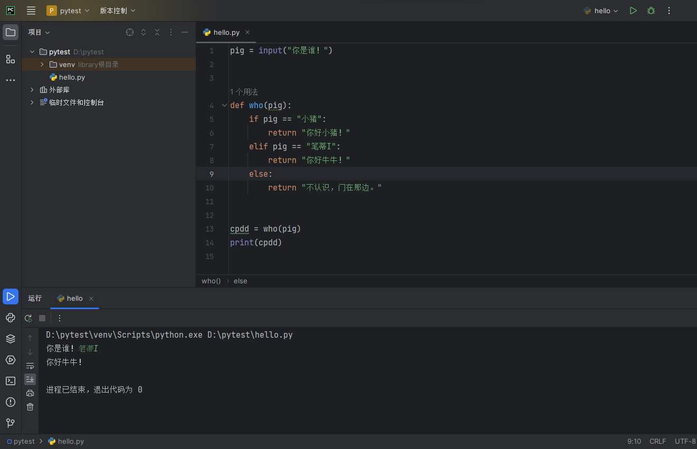
### 模块
模块是python中的一种代码组织形式，模块可以提高代码的复用性，模块可以提高代码的可读性，模块可以提高代码的可维护性。
引入模块的方式有三种,推荐使用第一种
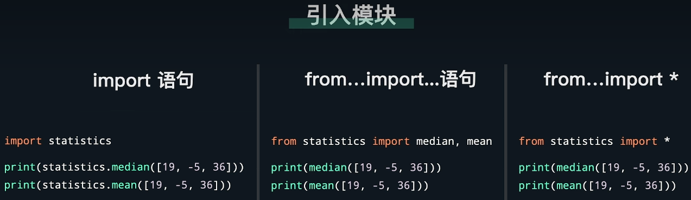

### 类
**前提了解：面向对象**
1. 封装
我的理解是将一些功能进行打包，使用者进行调用即可，不需要知道里面的具体实现。
2. 继承
就是将一些类的共同点提取出来，形成一个父类，然后让其他类继承这个父类，这样就可以减少代码的重复性。
3. 多态
多态是指同一种事物的多种形态，例如猫和狗都是动物，但是猫和狗的叫声是不一样的，这就是多态。
而所说到猫、狗都是子类，动物是父类。猫的叫声和狗的叫声是不一样的，这就是多态。
#### 类class
类的基础定义和调用方法。
__init__()方法是类的构造方法，用于初始化类的属性。
调用类的属性和方法的方式为：对象.属性名、对象.方法名()。
类的初始化属性：
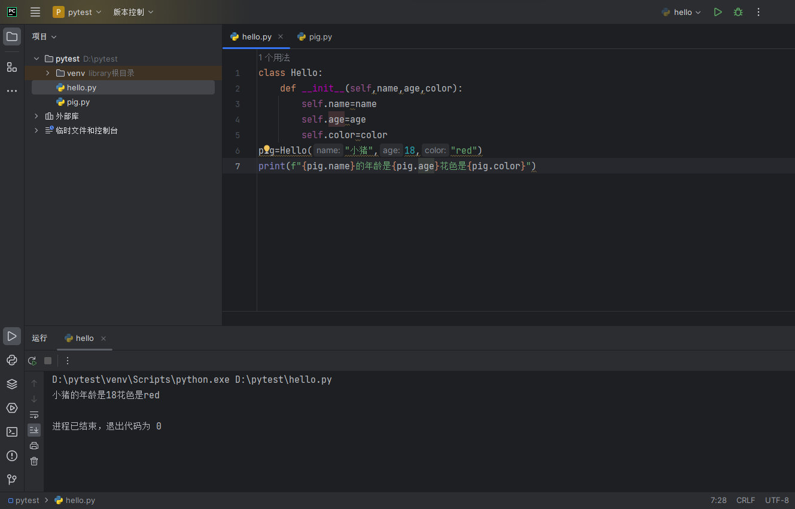
类定义方法：
方法名随意，同样也有个默认的参数self，self代表类的实例，代表当前对象。
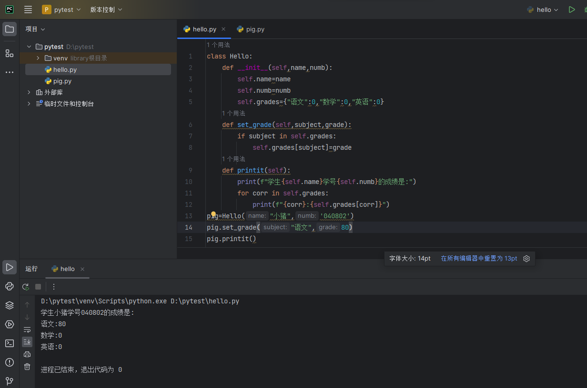
类的综合练习：公司分为全职员工和兼职员工，全职员工包含月薪，兼职员工包含日薪，全职员工和兼职员工都有姓名和工号，都可以打印出姓名和工号，全职员工和兼职员工都有计算工资的方法，全职员工的计算工资方法就是月薪，兼职员工的计算工资方法是日薪*工作天数。
```python
class Employee:
    def __init__(self,name,id):
        self.name=name
        self.id=id
    def print_info(self):
        print(f"姓名：{self.name} 工号：{self.id}")
        return ""

class FullTime(Employee):
    def __init__(self,name,id,monthly_salary):
        super().__init__(name,id)
        self.monthly_salary=monthly_salary
    def calculate_monthly_pay(self):
        self.monthly_salary=self.monthly_salary*0.8

class Stime(Employee):
    def __init__(self,name,id,daily_salary,work_day):
        super().__init__(name,id)
        self.daily_salary=daily_salary
        self.monthly_salary=0.0
        self.work_day=work_day
    def calculate_monthly_pay(self):
        self.daily_salary=self.daily_salary*0.8
        self.monthly_salary=self.work_day*self.daily_salary
pig=FullTime("pig",98,3000)
cat=Stime("cat",99,105,20)
print(pig.print_info())
print(cat.print_info())
pig.calculate_monthly_pay()
cat.calculate_monthly_pay()
print(pig.monthly_salary)
print(cat.monthly_salary)
```
输出:
```python
姓名：pig 工号：98
姓名：cat 工号：99
2400.0
1680.0
```
### 文件
open()函数用于打开文件，返回值为文件对象。
open()函数的语法格式如下：
```python
open(file,mode='r',encoding=None)
```
file：指定要打开的文件名。
mode：指定打开文件的模式，默认为'r'，只读模式。
encoding：指定打开文件的编码方式，默认为None，即使用系统默认的编码方式。
close()方法用于关闭文件。要注意的是，文件对象在使用完毕后必须关闭，否则会占用系统的资源。
close()方法的语法格式如下：
```python
文件对象.close()
```
read()方法用于读取文件中的内容，返回值为字符串类型。
read()方法的语法格式如下：
```python
文件对象.read()
```
readline()方法用于读取文件中的一行内容，返回值为字符串类型。
readline()方法的语法格式如下：
```python
文件对象.readline()
```
readlines()方法用于读取文件中的所有内容，返回值为列表类型。
readlines()方法的语法格式如下：
```python
文件对象.readlines()
```
如果怕忘记写close()方法，可以使用with语句来代替，with语句会自动关闭文件，例如
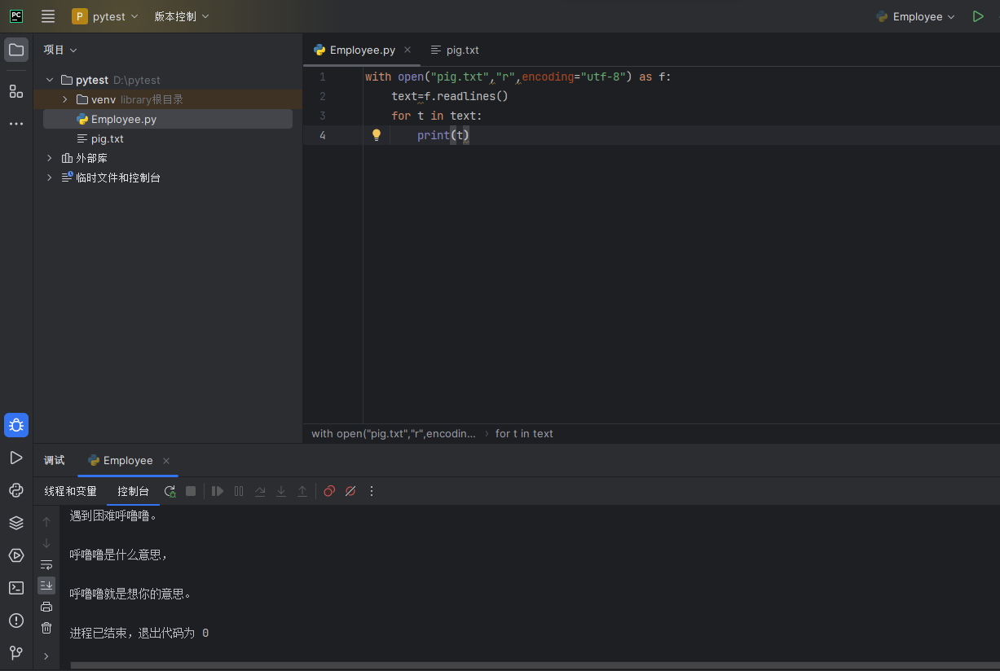
write()方法用于向文件中写入内容，返回值为写入的字符数。
无非就是将上面的”r"改成"w"，然后将read()改成write()，其他的都一样。
文件方面可参考[菜鸟教程](https://www.runoob.com/python3/python3-file-methods.html)
因为文件的内容比较多，之前也都学过所以就不一一列举了，有需要的可以去看看。
### 异常
try...except...else...finally...语句用于捕获异常。
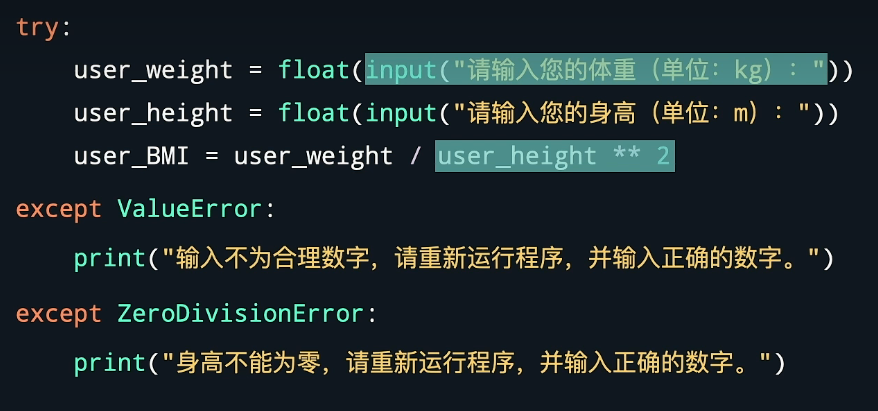
当然如果你无法预判错误类型也可以直接使用except：。
else：里面方如果没有错误执行的代码
finally：里面的代码不管有没有错误都会执行。

*over...只是随记，并没有很系统的学...*