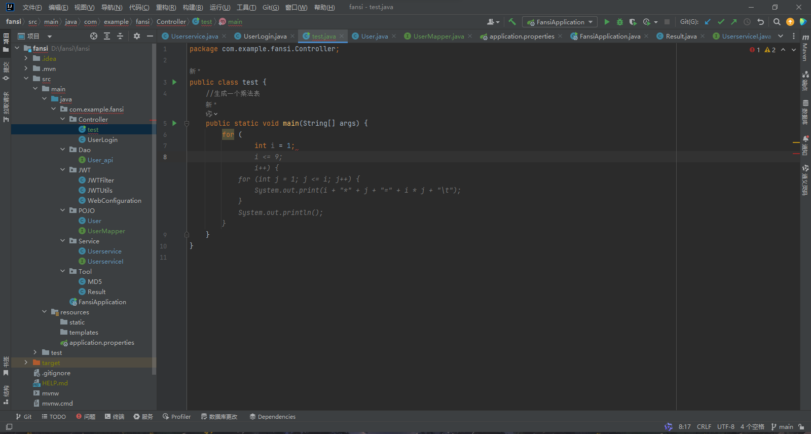
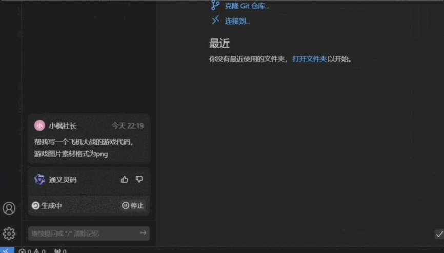
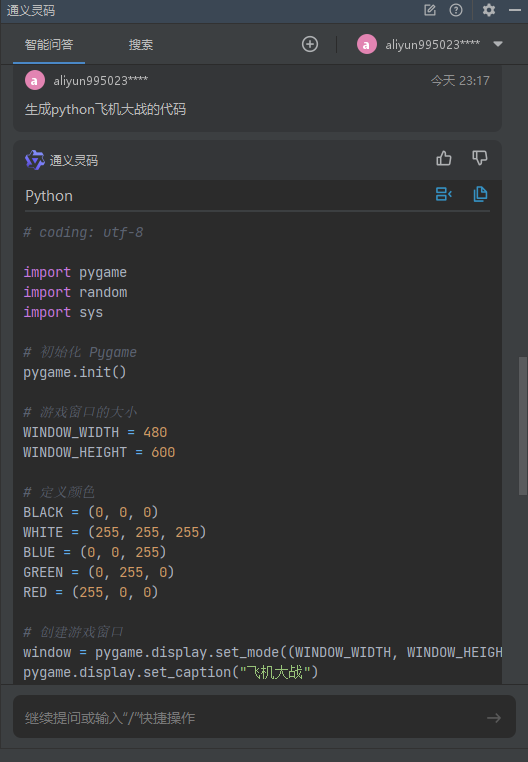
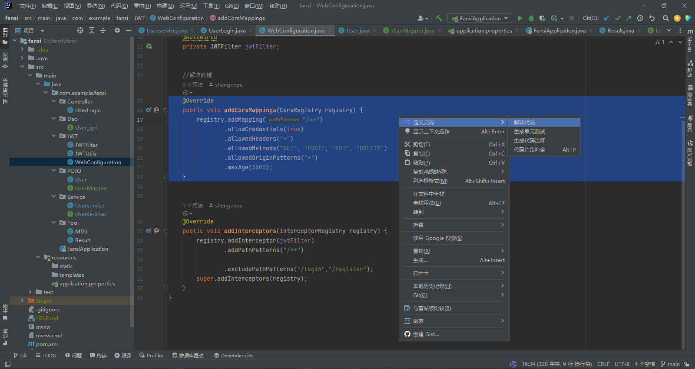
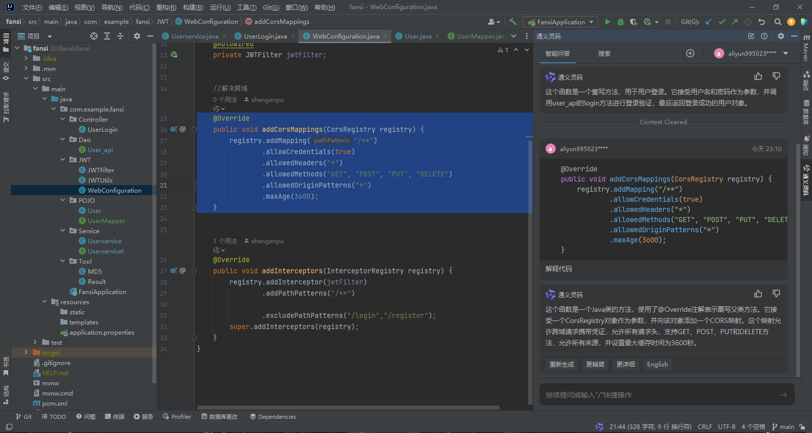

## 通义灵码
通义灵码是阿里云推出的企业级智能编码助手，支持开发者通过输入代码自动生成代码、提供智能编码推荐、自动修正代码bugs等功能，帮助开发者提高编码效率。

### 配置安装
支持Jetbrains全家桶和VSCode，对国内用户友好
配置地址：https://tongyi.aliyun.com/lingma/download
### 代码生成
让我想起了某位G姓故人

我用此一分钟生成了一套飞机大战的代码，

### 代码解释
当你复制别人的代码时是否有看不懂的困惑，特别是不同版本之间的代码，通义灵码就可以帮助你解决这个问题。
以这段java代码为例：

如果有不懂的地方可以继续向它进行提问，像不像请了个私人教师：

### 总结
除此之外功能还有很多很多，比如单元测试、异常报错、智能排查等等...可见阿里的实力还是非常强大的，关键是完全免费！！！