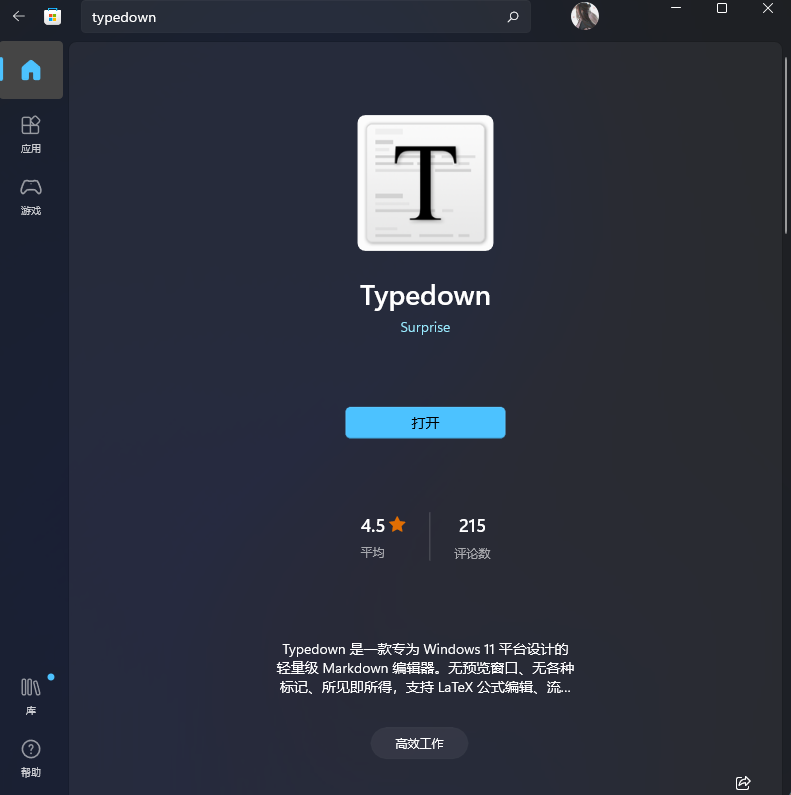
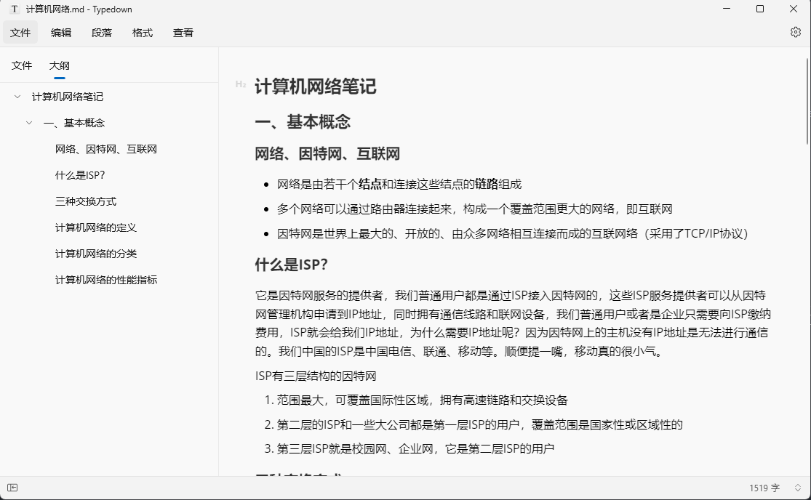
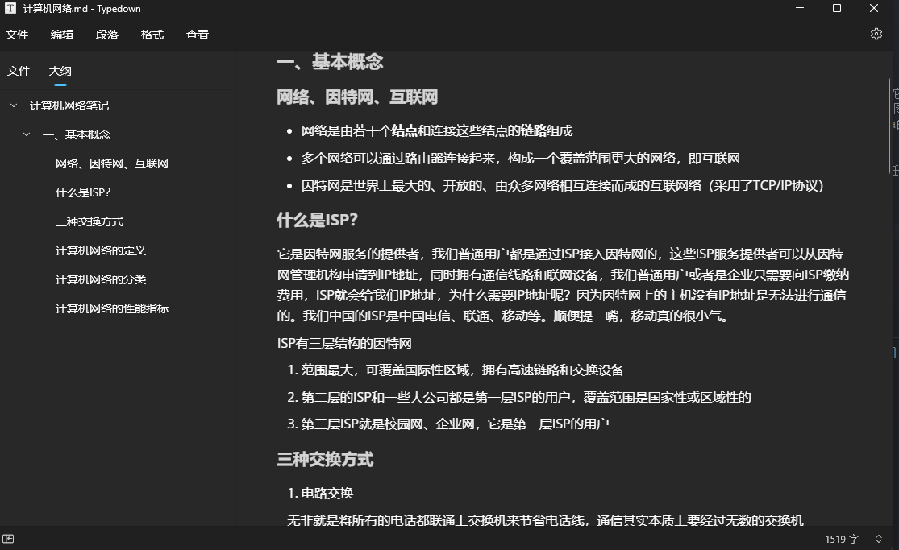
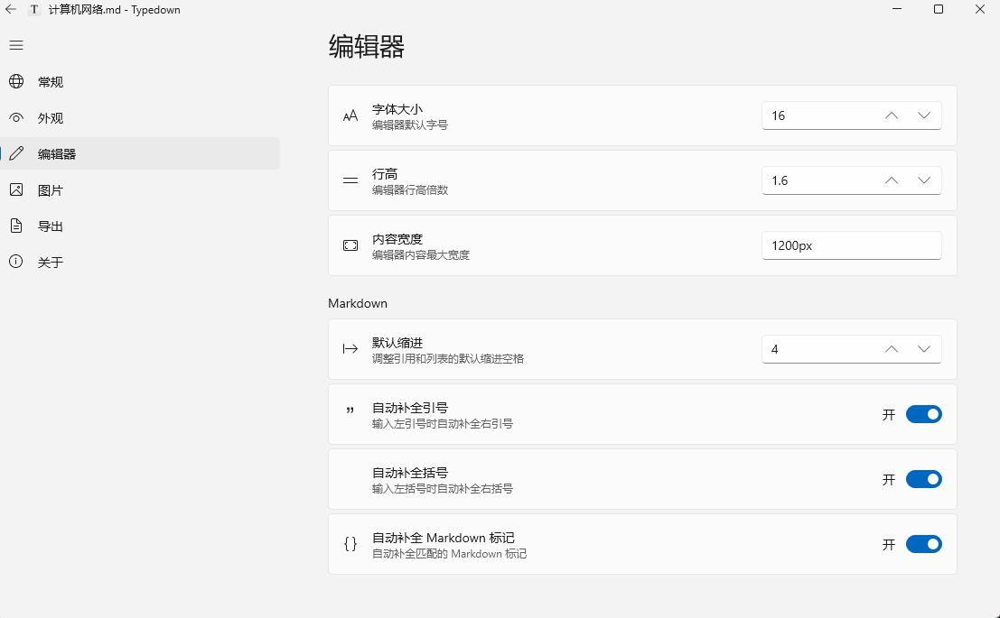

### 前言
很多人反映笔记软件typora进行了收费，就算是旧版也陆续停止了使用，这让很多朋友非常苦恼，期间我也找过很多笔记软件，有Notion（这是一款非常强大的笔记软件，但是它的花哨使用了很久typora的我很不习惯），还有Notable、Wolai、包括语雀、甚至于微软自带的OneNote，可是我就想记个笔记，帮助我记忆一些东西，这些笔记软件往往一些图案格式都要调很久，大部分时间都花在了调试好看的笔记样式上，因此对于我这种懒狗来说就需要一款简单，轻便，快速启动的笔记软件，为了白嫖的原则，我推荐一款平替typora的软件————Typedown
### Typedown
Typedown 是一款 Windows 下的轻量级 Markdown 编辑器，所见即所得，拥有打字机模式、专注模式，支持 LaTeX、代码高亮等功能。低 CPU 与内存占用，反应迅速，任何电脑都可流畅运行。
**软件特点：**
1. 实时预览：即时查看您的格式化文本效果
2. 语法高亮：直观展示 Markdown 语法
3. WinUI 框架：与 Windows 操作系统完美融合
4. 深色/浅色主题：根据喜好切换两种主题
5. 数学公式支持：轻松插入 LaTeX 数学公式
6. 代码块及语法高亮：支持多种编程语言的代码高亮显示
7. 导出为 HTML 和 PDF：将文档导出为常用格式
**下载方式**(Microsoft Store搜索即可)：

**软件效果：**
浅色模式

暗色模式

设置界面

笔记软件门槛还是非常低的，只需要熟悉markdown语法即可
不会markdown语法的可以借助以下教程学习，就是一种书写格式，并不难学
https://markdown.com.cn/basic-syntax/
数据珍贵，笔记记得备份哦，我推荐使用github仓库进行保存，每次写完，git进行推送即可，这里就不详细讲咋备份了，你也可以使用其它方式备份...