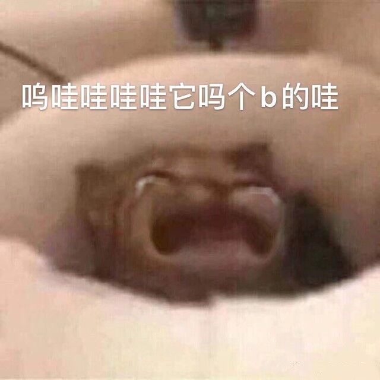

## 前言
随着十二月底的毕业，博客也有许久没更新了，说一下这三个月都在干嘛吧...主要还是闲聊哈，应该没人看。

### 闲聊
现在是2024年4月17日，时间真快啊，一切戛然在昨天，目前在京东做客服啦，其实是想找一份对口的工作呐，因为都知道现在的计算机特别是应用层方面的环境嘛，基本上投了就跟石头扔水里了一样，但是我也没说想放弃什么的，因为家里的原因嘛，我家其实很晚才生我，按理说我本该是个90后哈，所以其实现在我20岁，父母已经做不动了，所以这三个月呆在家里就很难受，前期的备考专转本肯没有那么直接的体会，但是考完了到家 难受...真难受...父母也天天盼着我可以出来分担点家里的压力，所以被迫在京东开启了三个月的客服生活，嘉然们放心哈，包溜回计算机的呐\~
先说说前期的备考吧，哇塞\~厚厚一叠的卷子，做的我每天都想放弃，一套、两套、三套...在考试前各科目也陆陆续续的刷完了几十套卷子这样子，因为从小到大其实也没给家里争过什么脸，也没取得过多厉害的成就，可能永远是人家孩子眼里的差生这样子，所以很看重这次的翻身机会吧，最后考试吧，其实发挥的已经很好了，但是某一科的卷子实在是恶魔，因为每一道题都可以作为最后一道大题来考，然而这一科刚好是我的强项，所以对我来说是非常不利的，考完那天我记得我哭了一下午，害，真的累了...那一刻真的不知道自己在坚持什么。能怎么办呐先回家！
emmm后面就是开头说的那些吧，找工作处处碰壁，家里的压力越来越大，只能emmm先干着了，这么些经历下来其实体会也是蛮多的，看清楚了很多事也看清楚了很多人，谈几个点吧，第一个就是感觉很多人会带有刻板印象，甚至整个中国都是这样，中国人多，所以永远不缺少六边形战士，永远也能出现六边形战士，一个人如果某个方面差，在中国这个环境是很难翻身的，特别是你差的这个方面刚好在很早的时候就暴露给其他人看了，而到了你的优势项目的时候往往人们会觉得前期做的优秀的人在现在这个项目也比你强，好比如小学的英语考试，你考了30分，后面你数学就算考满分人家也觉得我是抄的，这种刻板印象是很难改变的，再比如一个减肥成功的同学，现在大家提到这个人还是第一反应'胖',这种刻板印象可能需要个十年？二十年？才能抹去，再举个我自己这些天的例子吧，我打字可能比他们快，但是因为前期客服理论知识做的差的刻板印象，所以那些老师也总在质疑你打字速度的真实性，当然哈，我根本不会放在心上，还是想说明一下一个人的第一印象的重要性，为什么呐！因为这可以给你带来更多的资源，前期打好基础印象可能会给你带来第二次第三次的机会，当然啦你前期打下的好印象或者坏印象对于一个人来说是很不愿意去抹除的，因为人家不相信，不愿意接收，人们喜欢保持原样保持舒适，所以啊，人类就是这么一个带有温度又冷血的动物，再者现在是看脸的时代，可能我比较崇拜的北大的韦神，抹去人们的记忆，再看这个人可能有的人就会觉得是傻子，是痴子，这就是印象，当然哈，好在他是韦神，这个世界上又有多少神因为这种印象被排挤被忘记呢，看着那些十几岁入了厂的，进了流水线的，这世界上能逃过六边形战士定律的又有几个韦神呢？其实还是希望大家放下钢筋混泥土的大脑，重新看待每一个身边值得尊敬的每一个人吧，第二点就是不争和谦虚吧，不要把其他人看作是对手，其他人把你看作是对手你也要不屑，你的对手永远只有你自己，这个世界上没有那么多的眼光投向你，你不过只是他们短暂时光下的一簇，别人也是一样。你就和你自己比，今天比昨天多学了一点就是进步！总有一天，你会站在山头，俯视着山下，让别人记住。
害一口气吭哧吭哧写这么多了，聊点轻松的吧\~说来我也好久没出去玩了，上一次特地跑出去旅游还是五年前的瘦西湖，你们想去的地方在哪里捏，我来说说我吧，我个人比较喜欢重庆，有机会可以带家里人去那边旅游，感觉挺魔幻的一城市，主要是吃的多哈哈哈，另一个就是想和朋友们一起去日本吧，看看樱花，看看富士山，吃吃野餐嘻，这么些天在京东呆下来，从陌生到熟悉也过度了一点了，今后的规划还是毕业了回计算机行业吧，后面考虑做专业课老师这样子，再过个十年攒到比钱了可能会去创业，最好是有个自己的品牌，再往后二三十年，就是开店吧，从一家开到连锁，从餐饮、超市开到哪哪都是，插个眼，加油\~笔蒂I\~
OK了就胡说到这里，一通乱扯也没有再复读一遍，希望没有打错字，祝愿意看到这里的人天天开心，祝我天天开心，晚安各位\~早点睡\~zzz\~（push！）