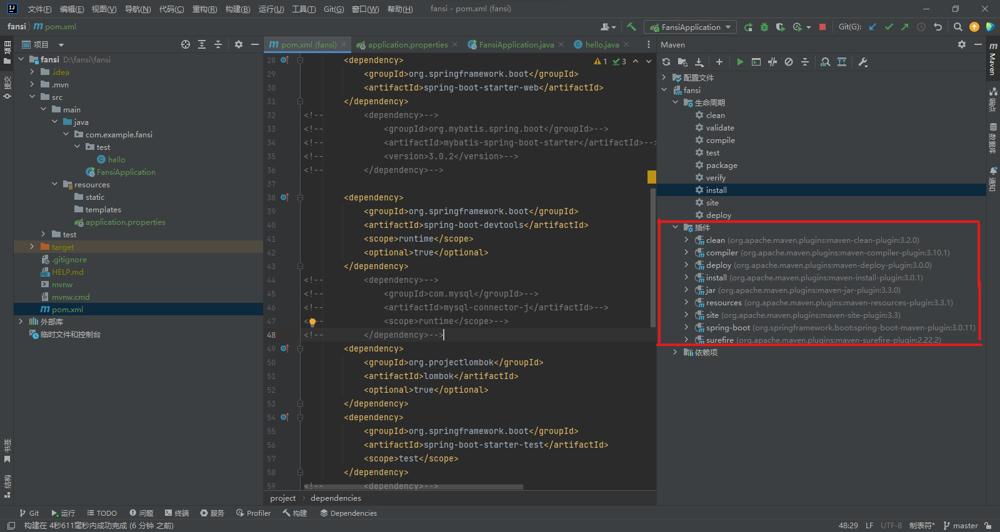
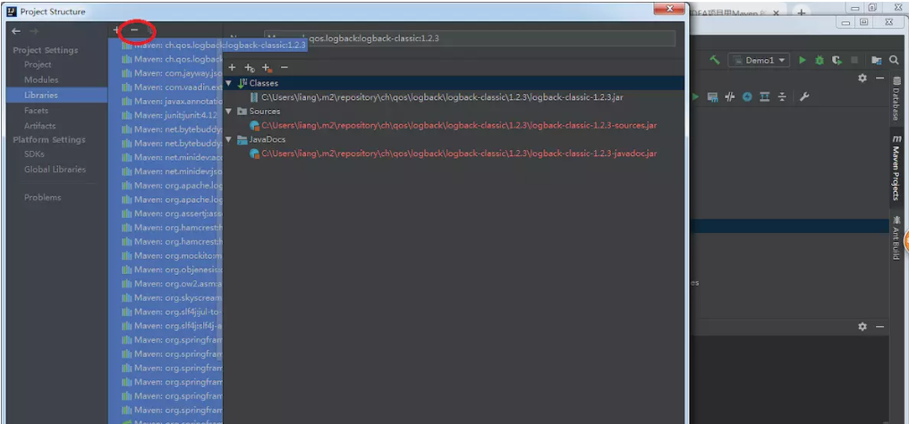
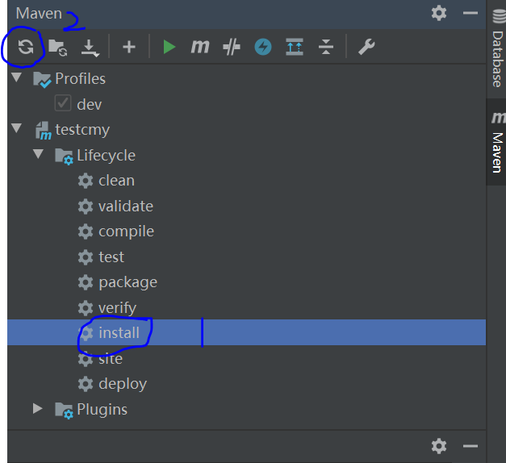

### 前言
哪里有坑就踩哪里！你就说你是不是地鼠叭！！！
#### maven插件爆红

哟！我还以为过年了，当你使用maven构建项目时，发现插件全部爆红。
原因是maven的plugin并未正在下载到本地。
**解决办法**：
步骤1：进入Project Settings或Project Structure（快捷键：ctrl+shift+alt+s），删除所有的Libraries。如下图：

 步骤2:删除项目之前产生的target目录以及目录内的内容。

 步骤3:使用maven内置的maven管理工具，先install再reimport。如下图：

 OK.爆红解决